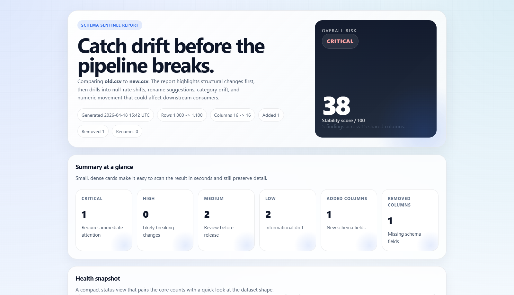

# Schema Sentinel

<p align="center">
  
</p>

<p align="center">
  <strong>A CSV drift detector that explains what changed, how risky it is, and what to check next.</strong>
</p>

<p align="center">
  Current release: <strong>v0.3.0</strong> - Built for CSV snapshots, committed contracts, and fast CI review
</p>

<p align="center">
  <a href="https://github.com/addaan1/schema-sentinel/blob/main/LICENSE"></a>
  <a href="https://github.com/addaan1/schema-sentinel"></a>
  <a href="https://github.com/addaan1/schema-sentinel/actions/workflows/ci.yml"></a>
  
</p>

Schema Sentinel helps you do two related jobs well:

- compare two CSV snapshots and understand what changed
- validate a new CSV against a committed `schema-contract.json` in CI

That makes it useful both for ad hoc investigation and for repeatable release checks where the team wants a contract they can review, commit, and enforce over time.

<table>
  <tr>
    <td align="center"><strong>Compare</strong><br />Two CSV snapshots side by side.</td>
    <td align="center"><strong>Contract</strong><br />Generate and validate a baseline policy.</td>
    <td align="center"><strong>Share</strong><br />Markdown, HTML, and JSON outputs.</td>
  </tr>
</table>

<p align="center">
  
</p>

<p align="center">
  <em>Preview rendered from <code>outputs/report.html</code>.</em>
</p>

## Example Data

The bundled `examples/` folder is based on the Kaggle [Telco Customer Churn](https://www.kaggle.com/datasets/blastchar/telco-customer-churn) dataset.
The sample files are generated from telco-style patterns and expanded to 1,000+ rows so the demo feels closer to a real production table:

- mixed numeric and categorical columns
- service flags and contract fields
- a billing column with a noticeable value shift
- an added text feedback column in the newer snapshot
- a removed backup column to demonstrate schema drift

That makes the demo more useful than a tiny toy CSV while keeping the repository lightweight.

You can regenerate the example snapshots with `python scripts/generate_examples.py`.

## Why It Exists

Most CSV diffs are technically correct but practically useless. Schema Sentinel focuses on the changes that usually cause real pain:

- schema breaks that can crash downstream jobs
- type changes that silently reshape your data
- null spikes that make features or dashboards unreliable
- category drift that introduces new values or removes old ones
- numeric drift that suggests behavior or distribution changes
- rename candidates that help you spot a column rebrand instead of a real deletion

## How It Works

1. You either compare two CSV files or generate a baseline contract from one CSV.
2. Schema Sentinel profiles the dataset column by column.
3. It detects structural drift, distribution drift, or contract breaches.
4. It prints a terminal summary and writes reports for humans and automation.

## What You Get Back

| Output | Purpose |
| --- | --- |
| Terminal report | Fast feedback in the console and CI logs |
| `summary.md` | Easy to paste into GitHub issues, PRs, or artifacts |
| `report.html` | A polished visual report for reviewers |
| `report.json` | Machine-readable output for automation |
| `schema-contract.json` | Commit-friendly baseline contract for repeatable validation |

## What It Detects

| Signal | Why it matters |
| --- | --- |
| Added / removed columns | Usually the first sign of schema breakage |
| Rename suggestions | Helps separate true deletions from renamed fields |
| Type changes | Catches columns that changed from numeric to text, date to string, and more |
| Null-rate changes | Surfaces missing-data spikes before they spread |
| Unique-ratio changes | Highlights cardinality shifts and unstable columns |
| Constant columns | Flags fields that stopped changing or were accidentally flattened |
| Category drift | Detects new or disappearing discrete values |
| Numeric drift | Spots distribution shifts in numeric columns |
| Risk scoring | Converts many signals into `LOW`, `MEDIUM`, `HIGH`, or `CRITICAL` |

## Contract-First Workflow

Schema Sentinel v0.3 is designed around a simple loop:

1. generate a baseline contract from a known-good CSV
2. review and edit the generated `schema-contract.json`
3. validate new CSV snapshots against that contract in CI
4. fall back to `compare` when you want a richer side-by-side investigation

The repository already includes a committed example contract:

- [`schema-contract.json`](schema-contract.json)

## Quick Start

Install the project locally with Python so the package lands in the active environment:

```bash
python -m pip install -e .[dev]
```

Generate a baseline contract from the known-good example snapshot:

```bash
python -m schema_sentinel contract init examples/old.csv --out schema-contract.json
```

Validate a candidate snapshot against the contract:

```bash
python -m schema_sentinel validate examples/old.csv --contract schema-contract.json
```

Run the side-by-side comparison flow when you want a deeper diff:

```bash
python -m schema_sentinel compare examples/old.csv examples/new.csv
```

This is the safest first command on Windows because it works even when the `schema-sentinel` console script is not on `PATH` yet.

After installation, the shorter console command also works:

```bash
schema-sentinel compare examples/old.csv examples/new.csv
```

Write every report format in one pass:

```bash
python -m schema_sentinel validate examples/old.csv --contract schema-contract.json --format all
```

Send the reports to a custom folder:

```bash
python -m schema_sentinel validate examples/old.csv --contract schema-contract.json --output-dir outputs
```

## Example Result

```text
Schema Sentinel
Validating old.csv against schema-contract.json

Overall risk: SAFE
Stability score: 100/100

Reports written to:
- outputs/summary.md
- outputs/report.html
- outputs/report.json
```

For a richer drift investigation, compare the old and new example snapshots directly:

```bash
python -m schema_sentinel compare examples/old.csv examples/new.csv
```

## Configuration

Schema Sentinel now uses two separate JSON files on purpose:

- `config.json` for runtime behavior such as output directory and output formats
- `schema-contract.json` for committed validation policy

Schema Sentinel auto-loads `config.json` from the current working directory when it exists. You can also point to a different file with `--config`.

Minimal example:

```json
{
  "output": {
    "directory": "outputs",
    "formats": ["markdown", "html", "json"],
    "fail_on": "high"
  },
  "matching": {
    "rename_threshold": 0.78
  }
}
```

Useful settings:

- `output.directory` controls where generated files are written
- `output.formats` can be `markdown`, `html`, `json`, `both`, or `all`
- `output.fail_on` sets the severity that should trigger exit code `2`
- `matching.rename_threshold` tunes how confident a rename suggestion must be

The generated contract is intentionally editable. A trimmed example looks like this:

```json
{
  "fail_on": "high",
  "dataset": {
    "strict_columns": false,
    "row_count": {
      "baseline": 1000,
      "min": 950,
      "max": 1050
    }
  },
  "columns": {
    "MonthlyCharges": {
      "required": true,
      "ignore": false,
      "semantic_type": "numeric",
      "nullable": false,
      "null_rate_max": 0.0,
      "numeric_drift": {
        "warn": 0.15,
        "fail": 0.35
      }
    }
  }
}
```

## CLI Reference

```bash
schema-sentinel compare <old.csv> <new.csv> [OPTIONS]
schema-sentinel contract init <baseline.csv> --out schema-contract.json
schema-sentinel validate <candidate.csv> --contract schema-contract.json [OPTIONS]
```

Options:

| Option | Meaning |
| --- | --- |
| `--config` | Load settings from a JSON config file |
| `--output-dir`, `-o` | Choose where report files are written |
| `--format`, `-f` | Select `markdown`, `html`, `json`, `both`, or `all` |
| `--fail-on` | Return exit code `2` when risk reaches the selected severity |
| `--contract` | Path to the schema contract used by `validate` |
| `--out` | Path written by `contract init` |

Exit codes:

- `0` means no findings or no risky drift
- `1` means findings exist, but they stay below the fail threshold
- `2` means critical drift or threshold-level risk was detected

## Build And Release

Install the packaging tools first, then build a local distribution:

```bash
python -m pip install build twine
python -m build
twine check dist/*
```

The repository also includes GitHub Actions for CI and release publishing so the project can be tested and packaged automatically.

The CI workflow now runs a dedicated contract validation job as well:

- it validates `examples/old.csv` against the committed [`schema-contract.json`](schema-contract.json)
- it writes `summary.md`, `report.html`, and `report.json` as workflow artifacts
- it writes a short Markdown summary to `GITHUB_STEP_SUMMARY` for fast PR review

## Development

Run the test suite:

```bash
pytest
```

Run linting:

```bash
ruff check .
```

## Troubleshooting

If you see `schema-sentinel : The term 'schema-sentinel' is not recognized`, the package is usually installed but the console script is not on `PATH` yet.

- Use `python -m schema_sentinel compare examples/old.csv examples/new.csv` as the reliable fallback.
- Make sure the same Python environment is active when you install and when you run the command.
- If you just installed the project, close and reopen PowerShell so the new PATH entry can refresh.

If `python` itself is not recognized on Windows:

- Install Python 3.11 or newer.
- Or disable the Windows App execution aliases for `python.exe` and `python3.exe`, then open a new terminal.

## Roadmap

- larger-file execution strategies beyond full in-memory CSV loading
- additional file format support beyond CSV
- validation history and trend-aware drift monitoring

## License

Released under the [Apache-2.0 License](LICENSE).
