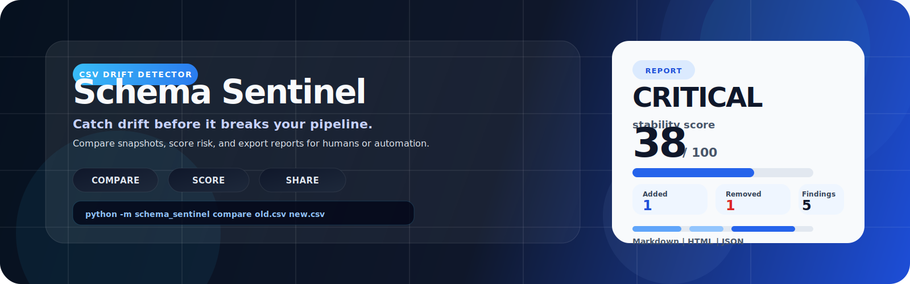
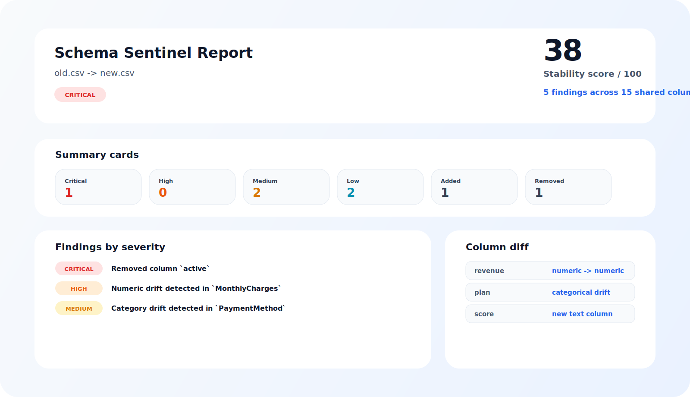

# Schema Sentinel

<p align="center">
  
</p>

<p align="center">
  <strong>Catch dataset drift before it breaks your pipeline.</strong>
</p>

<p align="center">
  <a href="https://github.com/addaan1/schema-sentinel/blob/main/LICENSE"></a>
  <a href="https://github.com/addaan1/schema-sentinel/actions/workflows/ci.yml"></a>
  
</p>

Schema Sentinel is a lightweight open-source CLI for comparing two CSV files and surfacing the changes that matter most. It helps you spot schema drift, type changes, null spikes, rename candidates, category drift, and numeric shifts before they turn into broken dashboards, failed pipelines, or misleading models.

## What It Does

- Compare two CSV files with one command
- Detect added and removed columns
- Suggest likely column renames with similarity scoring
- Detect semantic type changes
- Measure null-rate, uniqueness, category drift, and numeric drift
- Classify risk as `LOW`, `MEDIUM`, `HIGH`, or `CRITICAL`
- Generate a terminal summary, `summary.md`, `report.html`, and `report.json`
- Auto-load `config.json` from the working directory
- Return CI-friendly exit codes for automation

## Preview

<p align="center">
  
</p>

## Quick Start

Install the project locally:

```bash
pip install -e .[dev]
```

Run a comparison:

```bash
schema-sentinel compare examples/old.csv examples/new.csv
```

Write the reports to a custom folder:

```bash
schema-sentinel compare examples/old.csv examples/new.csv --output-dir outputs
```

Choose a single format:

```bash
schema-sentinel compare examples/old.csv examples/new.csv --format markdown
schema-sentinel compare examples/old.csv examples/new.csv --format html
schema-sentinel compare examples/old.csv examples/new.csv --format json
```

Write every artifact explicitly:

```bash
schema-sentinel compare examples/old.csv examples/new.csv --format all
```

Override the config file:

```bash
schema-sentinel compare examples/old.csv examples/new.csv --config config.json
```

## Configuration

Schema Sentinel looks for `config.json` in the current working directory first. If it finds one, the CLI uses it automatically.

Minimal example:

```json
{
  "output": {
    "directory": "outputs",
    "formats": ["markdown", "html", "json"],
    "fail_on": "high"
  },
  "matching": {
    "rename_threshold": 0.78
  }
}
```

Useful fields:

- `output.directory` - default artifact directory
- `output.formats` - one or more of `markdown`, `html`, `json`
- `output.fail_on` - severity threshold that triggers exit code `2`
- `matching.rename_threshold` - confidence required to suggest a rename

## Example Output

```text
Schema Sentinel
Comparing old.csv -> new.csv

Overall risk: CRITICAL
Stability score: 38/100

Top findings
- CRITICAL  Removed column `active`
- HIGH      Numeric drift detected in `revenue`
- HIGH      Category drift detected in `plan`

Reports written to:
- outputs/summary.md
- outputs/report.html
- outputs/report.json
```

## Output Files

- `summary.md` for GitHub, PRs, and artifact browsing
- `report.html` for a polished visual summary
- `report.json` for automation and downstream tooling
- terminal output for quick inspection and CI logs

## Command Reference

```bash
schema-sentinel compare <old.csv> <new.csv> [OPTIONS]
```

Options:

- `--config` - path to a JSON config file
- `--output-dir, -o` - directory for generated reports
- `--format, -f` - `markdown`, `html`, `json`, `both`, or `all`
- `--fail-on` - severity threshold that triggers a failing exit code

Exit codes:

- `0` - no findings
- `1` - warnings below the configured failure threshold
- `2` - critical or threshold-level drift detected

## Project Structure

```text
schema-sentinel/
|-- schema_sentinel/
|   |-- cli.py
|   |-- compare.py
|   |-- config.py
|   |-- drift.py
|   |-- matching.py
|   |-- report.py
|   |-- risk.py
|   |-- utils.py
|   `-- templates/
|-- config.json
|-- examples/
|-- tests/
|-- assets/
|-- .github/workflows/
|-- pyproject.toml
`-- LICENSE
```

## Design Direction

The HTML report uses a report-first visual language:

- minimal Swiss-inspired hierarchy
- strong contrast and clear spacing
- bento-style summary cards
- severity-first content ordering
- accessible colors and focus states
- responsive layout with no horizontal overflow

## Packaging and Release

Build the distribution locally:

```bash
python -m build
```

Check the generated artifacts:

```bash
twine check dist/*
```

The repository includes a GitHub Actions workflow that builds the wheel and sdist, uploads them to GitHub Releases, and publishes to PyPI with trusted publishing when a release is cut.

## Development

Run the tests:

```bash
pytest
```

Run linting:

```bash
ruff check .
```

## Roadmap

### v0.2.0
- config file support
- rename suggestions and smarter column matching
- JSON output
- release packaging for GitHub and PyPI

### v1.0.0
- more file formats
- stronger automation hooks
- improved report explainability

## License

Released under the [Apache-2.0 License](LICENSE).
